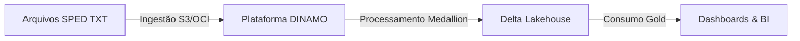
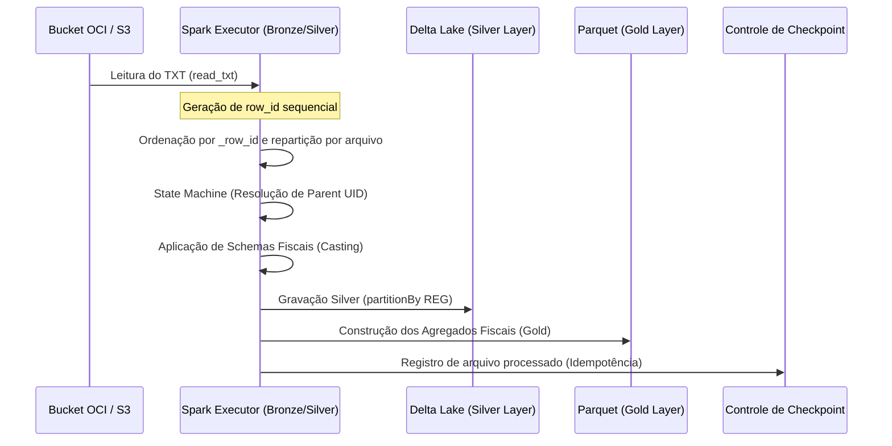
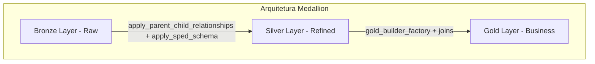
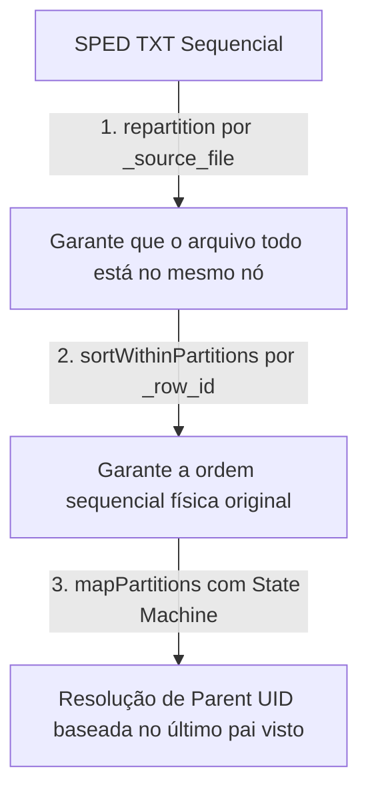

# Arquitetura do Sistema DINAMO (Architecture.md)

Este documento descreve a arquitetura geral da plataforma **DINAMO**, detalhando seus objetivos, fluxo end-to-end, a arquitetura Medallion e estratégias de processamento do Apache Spark e hierarquia SPED. Toda a fundamentação técnica está baseada no [Discovery_Report.md](file:///Ubuntu/home/{$USER}/dinamo_etl_project/Discovery_Report.md).

---

## 1. Visão Geral e Contexto de Negócio

O **DINAMO** é uma plataforma Tax Tech de Engenharia de Dados distribuída focada no processamento de arquivos do Sistema Público de Escrituração Digital (SPED). O sistema resolve a complexidade de ler arquivos de texto estruturados de forma sequencial-hierárquica (pipe-delimitados) e transformá-los em estruturas relacionais otimizadas para análise de Business Intelligence (BI) e auditorias fiscais.

### Objetivos da Plataforma
* **Rastreabilidade:** Preservar a origem exata de cada registro fiscal.
* **Corretude Fiscal:** Garantir que valores e apurações obedeçam estritamente aos grãos analíticos adequados.
* **Escalabilidade:** Utilizar o poder do Apache Spark para paralelizar o processamento de grandes volumes de documentos SPED.

---

## 2. Fluxo End-to-End e Arquitetura Geral

O fluxo de dados da plataforma é executado de forma orientada a lotes (*batch*) por arquivo, sendo cada arquivo mapeado para uma transação atômica. 

### Diagrama de Fluxo e Componentes Físicos

*Evidência de rastreabilidade: [Discovery_Report.md - Seção 1 (Bronze & Silver)](file:///Ubuntu/home/{$USER}/dinamo_etl_project/Discovery_Report.md#1-arquitetura-medallion-camadas-bronze-silver-e-gold) e [Discovery_Report.md - Seção 5 (Controle de Idempotência)](file:///Ubuntu/home/{$USER}/dinamo_etl_project/Discovery_Report.md#5-decisões-arquiteturais-identificadas-no-código).*

---

## 3. A Arquitetura Medallion no DINAMO

A modelagem de dados no Lakehouse está dividida em três camadas distintas de maturidade:

### Camada Bronze (Raw)
* **Status físico:** Arquivos estruturados em formato texto bruto, preservando as linhas originais enviadas pelo cliente.
* **Mecanismo:** A classe `BucketExtractor` lê os dados usando o Spark text reader e adiciona colunas técnicas de auditoria (`_source_file` e `_row_id`).
* *Evidência de rastreabilidade: [Discovery_Report.md - Seção 1.A (Camada Bronze)](file:///Ubuntu/home/{$USER}/dinamo_etl_project/Discovery_Report.md#a-camada-bronze-leitura-bruta).*

### Camada Silver (Refined)
* **Status físico:** Tabelas Delta Lake particionadas fisicamente por registro (`REG`).
* **Mecanismo:** Os dados de texto são convertidos para tipos fortes (inteiros, decimais, datas) utilizando schemas pré-definidos (`StructType`). Os relacionamentos hierárquicos são processados em nível de partição.
* *Evidência de rastreabilidade: [Discovery_Report.md - Seção 1.B (Camada Silver)](file:///Ubuntu/home/{$USER}/dinamo_etl_project/Discovery_Report.md#b-camada-silver-estruturao-validao-e-relacionamento).*

### Camada Gold (Business)
* **Status físico:** Arquivos Parquet particionados por `CNPJ`.
* **Mecanismo:** Contém visualizações e tabelas analíticas desnormalizadas (como o "Tabelão" ou relatórios auxiliares), prontas para serem lidas por ferramentas de BI.
* *Evidência de rastreabilidade: [Discovery_Report.md - Seção 1.C (Camada Gold)](file:///Ubuntu/home/{$USER}/dinamo_etl_project/Discovery_Report.md#c-camada-gold-vises-de-negcio--bi).*

---

## 4. Estratégia de Parent UID / UID

Devido à natureza não-relacional dos arquivos originais do SPED (onde a hierarquia é puramente posicional e sequencial), o DINAMO resolve a integridade referencial aplicando uma máquina de estados distribuída.

### Resolução de Vínculos Hierárquicos
Para evitar que o Spark processe as linhas fora de ordem, o sistema força um repartitioning por arquivo de origem (`_source_file`) seguido de ordenação interna pelo índice físico global (`_row_id`). 
A máquina de estados armazena em memória o `row_id` do último registro de nível superior avistado (ex: `0000`, `C100`) e injeta este valor como `_parent_uid_final` nos registros filhos sequenciais (ex: `C170`, `C190`).

*Evidência de rastreabilidade: [Discovery_Report.md - Seção 2 (Estratégia de Parent UID / UID)](file:///Ubuntu/home/{$USER}/dinamo_etl_project/Discovery_Report.md#2-estratgia-de-parent-uid--uid).*

---

## 5. Arquitetura Spark e Otimizações de Performance

O motor Apache Spark é configurado de forma a evitar re-computações do grafo acíclico dirigido (DAG) e otimizar a largura de banda de rede do cluster:

* **Adaptive Query Execution (AQE):** Habilitado para ajustar dinamicamente o número de partições pós-shuffle, otimizar joins desbalanceados e converter joins de shuffle em broadcast quando aplicável.
* **Cachê Estratégico:** Aplicação de `.cache()` acompanhado de uma action (`.count()`) para persistir os dataframes intermediários e evitar N leituras completas dos arquivos TXT brutos durante o processamento.
* **Estratégia de Particionamento Delta:** Particionamento físico por `REG` na Silver e por `CNPJ` na Gold para minimizar a quantidade de dados lidos durante as queries analíticas.

*Evidência de rastreabilidade: [Discovery_Report.md - Seção 4 (Detalhes de Arquitetura Apache Spark)](file:///Ubuntu/home/{$USER}/dinamo_etl_project/Discovery_Report.md#4-detalhes-de-arquitetura-apache-spark).*
