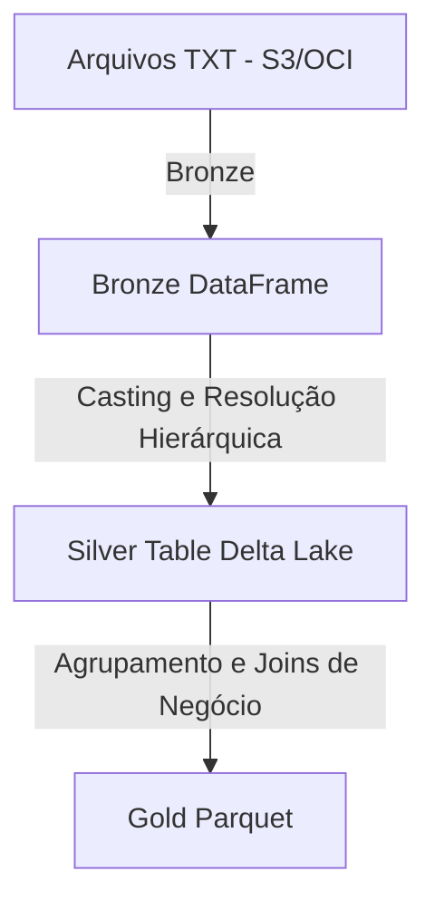
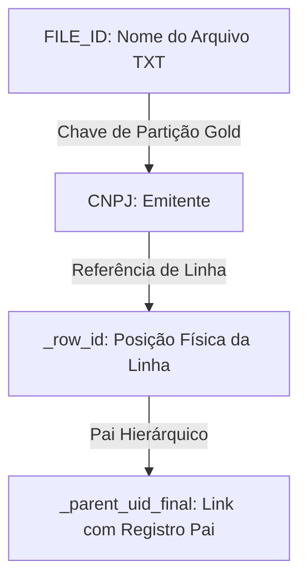
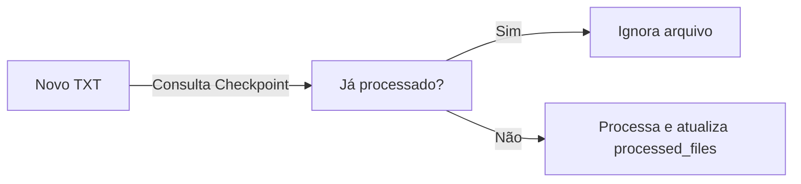

# Plataforma de Dados DINAMO (DataPlatform.md)

Este documento detalha o ciclo de vida dos dados, a estruturação física das camadas, a governança de metadados técnicos e a estratégia de linhagem da plataforma **DINAMO**, com base exclusivamente nas evidências do [Discovery_Report.md](file:///Ubuntu/home/{$USER}/dinamo_etl_project/Discovery_Report.md).

---

## 1. Visão Geral do Data Platform

O DINAMO opera como um Lakehouse distribuído baseado em Apache Spark. Ele transforma arquivos semi-estruturados de texto SPED em dados altamente estruturados e governados, permitindo rastreabilidade completa desde a linha de texto original até a tabela de BI final.

---

## 2. Detalhamento Físico das Camadas (Bronze, Silver, Gold)

### A. Camada Bronze (Raw Ingestion)
* **Objetivo:** Ingerir os arquivos SPED sem alterar o conteúdo original, apenas aplicando colunas de auditoria técnica.
* **Componentes de Rastreabilidade:**
  * **Arquivo:** [`dinamo_web/src/dinamo_web/extractors/bucket_extractor.py`](file:///Ubuntu/home/{$USER}/dinamo_etl_project/dinamo_web/src/dinamo_web/extractors/bucket_extractor.py)
  * **Chaves Técnicas Adicionadas:**
    * `_source_file`: Identificador absoluto do arquivo original (obtido via `F.input_file_name()`).
    * `_row_id`: Identificador sequencial incremental por partição física.
    * `_row_id_file`: Índice numérico determinístico ordenado que indica a linha exata dentro do arquivo.
* *Evidência de rastreabilidade: [Discovery_Report.md - Seção 1.A](file:///Ubuntu/home/{$USER}/dinamo_etl_project/Discovery_Report.md#a-camada-bronze-leitura-bruta).*

### B. Camada Silver (Refined & Canonicalized)
* **Objetivo:** Garantir a qualidade de tipos, estruturar os registros em tabelas relacionais e reconstruir a hierarquia de dados do SPED.
* **Características Físicas:**
  * **Formato:** Delta Lake.
  * **Particionamento:** Fisicamente particionado pela coluna `REG` (registro do SPED).
  * **Superset Canônico:** Através do método `unionByName(allowMissingColumns=True)`, o DINAMO unifica múltiplos registros estruturados em um único schema canônico Silver para cada CNPJ/Período, preenchendo com `null` os campos ausentes de registros distintos.
* *Evidência de rastreabilidade: [Discovery_Report.md - Seção 1.B](file:///Ubuntu/home/{$USER}/dinamo_etl_project/Discovery_Report.md#b-camada-silver-estruturao-validao-e-relacionamento).*

### C. Camada Gold (Business Aggregates)
* **Objetivo:** Expor visões desnormalizadas prontas para auditorias e BI.
* **Características Físicas:**
  * **Formato:** Parquet normalizado.
  * **Particionamento:** Por `CNPJ`.
  * **Garantia de Não-Duplicação:** Os dados são modelados separadamente respeitando os grãos de Documento, Item e Total Fiscal.
* *Evidência de rastreabilidade: [Discovery_Report.md - Seção 1.C](file:///Ubuntu/home/{$USER}/dinamo_etl_project/Discovery_Report.md#c-camada-gold-vises-de-negcio--bi) e [Discovery_Report.md - Seção 3](file:///Ubuntu/home/{$USER}/dinamo_etl_project/Discovery_Report.md#3-os-trs-gros-analticos-da-camada-gold).*

---

## 3. Estratégia de Identificadores e Linhagem (Data Lineage)

O DINAMO implementa uma árvore de linhagem que conecta as linhas analíticas de BI diretamente aos arquivos fiscais de origem.

* **FILE_ID:** Mapeado diretamente a partir do `basename` do arquivo TXT processado. Serve como chave primária de auditoria de carga.
* **_row_id / UID:** Identificador numérico determinístico associado a cada registro extraído.
* **_parent_uid_final:** O UID do registro pai correspondente, permitindo joins hierárquicos instantâneos na camada Gold (ex: associar itens de `C170` ao cabeçalho `C100`).

*Evidência de rastreabilidade: [Discovery_Report.md - Seção 2](file:///Ubuntu/home/{$USER}/dinamo_etl_project/Discovery_Report.md#2-estratgia-de-parent-uid--uid).*

---

## 4. Governança de Metadados e Checkpoint

Para garantir a idempotência e governança operacional:
* **Tabela de Controle Delta (`processed_files`):** O orquestrador realiza uma leitura da tabela Delta de controle para obter os hashes/nomes de arquivos já processados.
* **Transação Delta Lake:** Gravações Silver utilizam o formato Delta Lake para garantir as propriedades ACID (Atomicidade, Consistência, Isolamento e Durabilidade) e permitir a evolução do schema (`mergeSchema = true`) de forma segura.

*Evidência de rastreabilidade: [Discovery_Report.md - Seção 4 (Checkpoint e Idempotência) e Seção 5 (Delta Lake)](file:///Ubuntu/home/{$USER}/dinamo_etl_project/Discovery_Report.md#4-detalhes-de-arquitetura-apache-spark).*
