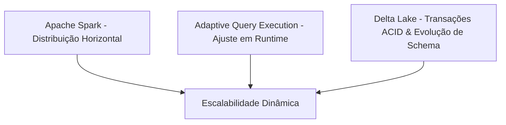

# Visão Arquitetural Executiva (ExecutiveArchitecture.md)

Este documento descreve a visão geral da plataforma **DINAMO**, traduzindo sua complexidade técnica em valor de arquitetura corporativa e de negócios. Ele foi projetado para CTOs, Heads de Engenharia, Arquitetos Corporativos e Investidores Técnicos. Toda a fundamentação técnica e de dados está baseada no [Discovery_Report.md](file:///${HOME}/dinamo_etl_project/Discovery_Report.md).

---

## 1. Executive Summary

O **DINAMO é uma plataforma Tax Tech** desenvolvida para transformar grandes volumes de dados fiscais em inteligência tributária acionável.

Empresas brasileiras convivem com um dos ambientes tributários mais complexos do mundo, caracterizado por milhares de regras fiscais, constantes mudanças regulatórias e grandes volumes de informações transmitidas por meio do SPED. Nesse contexto, a simples posse dos dados não é suficiente. O desafio está em transformar essas informações em conformidade, governança e oportunidades financeiras.

O DINAMO foi concebido para atuar como uma camada tecnológica especializada capaz de converter dados fiscais brutos em informações estruturadas para auditoria, compliance, recuperação tributária e tomada de decisão.

Mais do que uma plataforma de processamento, o DINAMO representa uma infraestrutura estratégica para iniciativas de compliance, auditoria e inteligência tributária, aumentando a capacidade analítica e escalar operações tributárias com segurança.
---

## 2. O Problema

O processamento tributário corporativo enfrenta severos desafios operacionais e tecnológicos:

* **Complexidade do Layout SPED:** Os arquivos fiscais contêm estruturas posicionais complexas, sem cabeçalhos explícitos em cada linha, organizados de forma sequencial física. A hierarquia (pai-filho) é definida apenas pela ordem física de aparecimento no arquivo.
* **Explosão do Volume de Dados:** Grandes varejistas e indústrias geram diariamente milhões de linhas de itens de notas fiscais, inviabilizando processamentos em memória convencional de nós únicos.
* **Dificuldade de Auditoria e Recuperação Fiscal:** A reconciliação entre o imposto apurado pelo item da nota fiscal e os totais declarados pelo fechamento fiscal exige análises minuciosas para identificar potenciais perdas financeiras ou riscos de autuação.
* **Escalabilidade Limitada:** Abordagens de bancos de dados relacionais tradicionais falham ao tentar processar e unir milhões de registros aninhados de forma distribuída.

---

## 3. Diferencial de Negócio
O DINAMO não foi concebido apenas como uma plataforma de processamento de dados. Sua arquitetura foi projetada especificamente para o contexto tributário brasileiro, incorporando conhecimento de domínio relacionado aos layouts SPED, às estruturas hierárquicas dos registros fiscais e às necessidades de auditoria e recuperação tributária.

Enquanto plataformas genéricas de dados focam exclusivamente na movimentação e transformação de informações, o DINAMO busca reduzir a distância entre o dado fiscal bruto e a geração de valor tributário. Para isso, combina mecanismos de engenharia de dados em larga escala com estruturas analíticas orientadas para validação fiscal, rastreabilidade, auditoria e identificação de oportunidades de recuperação de créditos.

Essa abordagem permite que a plataforma evolua além do simples armazenamento de dados, tornando-se uma base tecnológica para iniciativas de Tax Analytics, Compliance Fiscal e Tax Recovery.

##  4. Visão da Plataforma

O DINAMO resolve esses desafios operacionais através de um pipeline estruturado que desacopla a ingestão, a normalização de dados e a entrega de valor de negócios:

* **Bronze Layer (Ingestão):** Garante a cópia exata do arquivo TXT e gera os identificadores de linha (`_row_id`) determinísticos.
* **Silver Layer (Normalização):** Resolve a hierarquia do SPED e aplica o casting forte de dados. Os dados são salvos em Delta Lake particionados pelo código de registro (`REG`).
* **Gold Layer (Agregados):** Consolida visões específicas (como o "Tabelão" de auditoria) unindo os registros e os enriquecendo com regras de negócios específicas (ex: CFOP, regimes tributários).

*Evidência de rastreabilidade: [Discovery_Report.md - Seção 1 (Arquitetura Medallion)](file:///${HOME}/dinamo_etl_project/Discovery_Report.md#1-arquitetura-medallion-camadas-bronze-silver-e-gold).*

---

## 5. Princípios Arquiteturais

A arquitetura do DINAMO assenta-se em princípios sólidos de engenharia de dados corporativa:

* **Metadata-Driven Processing (Processamento Guiado por Metadados):** O sistema utiliza o código do registro (ex: `C100`, `C170`) para carregar dinamicamente seus schemas estáticos do Spark (`StructType`) e mapas posicionais (`FIELDS_MAP`).
* **Configuration-Driven Architecture (Configuração via YAML):** Joins, aliasing, seleções e agrupamentos da camada Gold são declarados em arquivos de configuração YAML, mantendo o código Python isolado de mudanças regulatórias.
* **Processamento Distribuído Escalável:** Desenvolvido inteiramente sobre PySpark, permitindo que o processamento seja distribuído horizontalmente em um cluster de múltiplos workers.
* **Data Lakehouse:** Combina o baixo custo de armazenamento do Object Storage (S3/OCI) com as garantias transacionais e indexação rápida do Delta Lake.

*Evidência de rastreabilidade: [Discovery_Report.md - Seção 3 (Padrões Arquiteturais) e Seção 5 (Decisões Arquiteturais)](file:///${HOME}/dinamo_etl_project/Discovery_Report.md#3-padres-arquiteturais-identificados).*

---

## 6. Diferenciais Técnicos

O DINAMO destaca-se devido a soluções específicas para os desafios inerentes ao SPED:

* **Resolução Hierárquica por Partição (Parent UID / UID):** Para garantir que o relacionamento sequencial do SPED não seja corrompido pelo paralelismo do Spark, o DINAMO reordena e particiona os dados por arquivo e aplica uma máquina de estados na partição. Isso gera chaves sintéticas (`_parent_uid_final`) extremamente precisas para joins hierárquicos posteriores.
* **Canonicalização de Registros:** Unificação de layouts drasticamente diferentes usando um superset que une colunas e preenche lacunas com valores nulos.
* **Modelagem Multi-Grão da Camada Gold:** Separação rígida de relatórios nos grãos de **Documento**, **Item** e **Total Fiscal (Apuração)**, evitando duplicação silenciosa de valores de impostos ao realizar agregações analíticas.

*Evidência de rastreabilidade: [Discovery_Report.md - Seção 2 (Estratégia de Parent UID / UID) e Seção 3 (Os Três Grãos Analíticos da Camada Gold)](file:///${HOME}/dinamo_etl_project/Discovery_Report.md#2-estratgia-de-parent-uid--uid).*

---

## 7. Escalabilidade: Crescimento sem Reescrita

### "Como a plataforma cresce sem reescrita?"

O DINAMO escala linearmente com o aumento do volume de dados fiscais devido a três pilares de design:

1. **Paralelismo Horizontal do Spark:** Se o volume diário de notas fiscais triplicar, basta provisionar mais nós (Workers) no cluster do Spark. O código do pipeline permanece inalterado.
2. **Adaptive Query Execution (AQE):** Ajusta em tempo de execução o plano do Spark, reduzindo partições de shuffle desnecessárias e balanceando distorções de tamanho de partições (*skew join*).
3. **Delta Lake Schema Evolution:** Quando o governo federal altera o layout adicionando novos campos, a evolução de schema integrada (`option("mergeSchema", "true")`) atualiza os metadados da tabela Silver de forma transparente sem quebrar queries ou compatibilidades reversas.

*Evidência de rastreabilidade: [Discovery_Report.md - Seção 4 (Arquitetura Spark) e Seção 5.B (Escolha do Delta Lake)](file:///${HOME}/dinamo_etl_project/Discovery_Report.md#4-detalhes-de-arquitetura-apache-spark).*

---

## 8. Governança e Confiabilidade

A robustez da plataforma é assegurada por mecanismos de proteção e controle operacional:

* **Validação Schemática Posicional:** O resolvedor valida de forma *fail-fast* o mapa físico em relação ao tipo do dado antes de prosseguir com a computação do Spark.
* **Controle de Idempotência por Checkpoint:** Uma tabela Delta registra os hashes de processamento de arquivos com sucesso. Isso impede que execuções duplicadas ou parciais recomputem dados desnecessariamente.
* **Data Lineage nativa:** A presença constante das colunas técnicas `FILE_ID` e `_row_id` nas camadas Silver e Gold permite reconstruir o caminho de auditoria exato de qualquer valor financeiro de volta ao arquivo de texto original.
* **Observabilidade via Prometheus & Grafana:** O cluster possui monitoramento integrado via JMX Exporters coletando dados e métricas em tempo real dos tópicos de mensagens no Kafka.

*Evidência de rastreabilidade: [Discovery_Report.md - Seção 2 (Estratégias de Validação) e Seção 4 (Arquitetura Kafka & Schema Registry)](file:///${HOME}/dinamo_etl_project/Discovery_Report.md#4-arquitetura-kafka--schema-registry).*

---

## 9. Evolução Arquitetural

Baseado no roadmap técnico, a plataforma está desenhada para suportar os seguintes estágios de crescimento técnico:

* **Curto Prazo (Padronização):** Refatorar orquestradores de pipelines em uma estrutura de classe abstrata genérica para eliminar código redundante e simplificar a integração de novas obrigações acessórias.
* **Médio Prazo (Performance):** Substituir o loop serial de leitura de arquivos por pools multi-threaded no Driver do Spark, reduzindo o tempo de inatividade dos Workers e otimizando o throughput geral.
* **Longo Prazo (Resiliência):** Validação dinâmica e contextualizada com base no código de versão (`COD_VER`) do registro raiz `0000`, carregando o mapa posicional de forma contextual ao manual de SPED correspondente da data de apuração.

*Evidência de rastreabilidade: [Roadmap de Evolução da Arquitetura (RoadmapArchitecture.md)](file:///${HOME}/dinamo_etl_project/docs/RoadmapArchitecture.md).*

---

## 10. Conclusão

O **DINAMO** não é apenas um script de transformação de dados; é um motor de processamento distribuído robusto projetado especificamente para lidar com as peculiaridades operacionais e hierárquicas da área fiscal e tributária. 

Sua arquitetura baseada em metadados e YAML, a união estável de Spark com Delta Lake, e sua estratégia única de resolução hierárquica por partição (Parent UID) qualificam o DINAMO como uma solução corporativa de ponta, flexível o suficiente para evoluir junto com a legislação fiscal e robusta para suportar crescimento contínuo do volume de dados e novas obrigações fiscais.