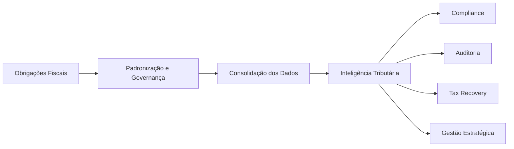
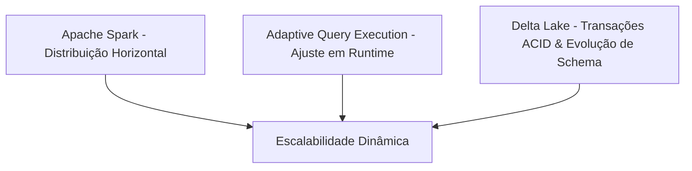

# Visão Arquitetural Executiva (ExecutiveArchitecture.md)

Este documento descreve a visão geral da plataforma **DINAMO**, traduzindo sua complexidade técnica em valor de arquitetura corporativa e de negócios. Ele foi projetado para Diretores de Operações, de Negócios, Heads de Engenharia, Arquitetos Corporativos e Investidores Técnicos. Toda a fundamentação técnica e de dados está baseada no [Discovery_Report.md](file:///${HOME}/dinamo_etl_project/docs/Discovery_Report.md).

---

## 1. Executive Summary

O **DINAMO é uma plataforma Tax Tech** desenvolvida para transformar grandes volumes de dados fiscais em inteligência tributária acionável.

Empresas brasileiras convivem com um dos ambientes tributários mais complexos do mundo, caracterizado por milhares de regras fiscais, constantes mudanças regulatórias e grandes volumes de informações transmitidas por meio do SPED. Nesse contexto, a simples posse dos dados não é suficiente. O desafio está em transformar essas informações em conformidade, governança e oportunidades financeiras.

O DINAMO foi concebido para atuar como uma camada tecnológica especializada capaz de converter dados fiscais brutos em informações estruturadas para auditoria, compliance, recuperação tributária e tomada de decisão.

Mais do que uma plataforma de processamento, o DINAMO representa uma infraestrutura estratégica para iniciativas de compliance, auditoria e inteligência tributária, aumentando a capacidade analítica e escalar operações tributárias com segurança.

---
## 2. Oportunidade de Mercado

O mercado tributário brasileiro movimenta bilhões de reais em oportunidades relacionadas à conformidade fiscal, recuperação de créditos e redução de contingências.

Apesar disso, grande parte das organizações ainda depende de processos manuais, planilhas, extrações pontuais e análises isoladas para interpretar informações fiscais.

Esse cenário cria um espaço significativo para plataformas capazes de automatizar o processamento de dados tributários e transformá-los em ativos estratégicos para o negócio.

O DINAMO foi desenvolvido para ocupar esse espaço, criando uma fundação tecnológica que conecta dados fiscais, governança e inteligência tributária em uma única plataforma.

## 3. O Problema

As empresas enfrentam quatro desafios centrais na gestão tributária:

* **Grande volume de informações fiscais distribuídas em múltiplas obrigações acessórias.
* **Dificuldade para consolidar dados em uma visão única e confiável.
* **Alto custo operacional para auditorias e revisões tributárias.
* **Necessidade crescente de rastreabilidade, governança e conformidade regulatória.

Esses fatores limitam a capacidade das organizações de identificar riscos, oportunidades de recuperação tributária e ganhos de eficiência operacional.

---

## 4. Diferenciais Competitivos
Especialização Tributária

O DINAMO foi concebido especificamente para o contexto tributário brasileiro, incorporando conhecimento de domínio relacionado ao SPED, auditoria fiscal e recuperação tributária.

Escalabilidade Empresarial

A plataforma foi desenhada para acompanhar o crescimento do volume de dados e da complexidade operacional sem exigir reestruturações frequentes.

Governança e Auditabilidade

Cada informação processada mantém sua rastreabilidade de origem, permitindo auditorias completas e maior confiança nos resultados produzidos.

Base para Novos Produtos

A arquitetura permite a construção de soluções adicionais de Tax Analytics, Compliance Fiscal, Tax Recovery e Inteligência Tributária sobre a mesma fundação tecnológica.

## 5. Como o DINAMO Gera Valor

graph LR
    Dados[Fonte Fiscal] --> Plataforma[DINAMO]
    Plataforma --> Compliance[Compliance]
    Plataforma --> Auditoria[Auditoria]
    Plataforma --> Recovery[Tax Recovery]
    Plataforma --> Analytics[Inteligência Tributária]

O valor do DINAMO não está apenas no processamento de dados, mas na capacidade de transformar informações fiscais em decisões de negócio.

A plataforma permite:

Redução do esforço operacional em auditorias fiscais.
Aumento da rastreabilidade e governança dos dados.
Identificação de oportunidades de recuperação tributária.
Consolidação de informações para análises estratégicas.
Criação de uma base única de dados fiscais para toda a organização.4

## 6. Plataforma em Alto Nível

O DINAMO foi concebido como uma plataforma capaz de transformar dados fiscais brutos em inteligência tributária para diferentes áreas da organização.

## 7. Capacidades Tecnológicas
A plataforma foi construída para atender requisitos corporativos de escalabilidade, governança e confiabilidade.

Entre suas principais capacidades destacam-se:

- Processamento de grandes volumes de dados fiscais.
- Rastreabilidade completa das informações processadas.
- Governança e controle de qualidade dos dados.
- Capacidade de evolução diante de mudanças regulatórias.
- Integração com ferramentas analíticas e de visualização.
- Estrutura preparada para processamento distribuído.
- Arquitetura orientada à expansão de novos produtos tributários.

Essas capacidades permitem que o DINAMO suporte desde iniciativas de auditoria fiscal até projetos mais avançados de inteligência tributária e automação de análises.

## 8 – Crescimento e Futuro

O DINAMO foi projetado para se tornar a fundação tecnológica das iniciativas tributárias do Grupo AG.

A evolução planejada da plataforma está estruturada em três horizontes:

### Curto Prazo

- Ampliação do suporte a novas obrigações acessórias.
- Padronização dos processos de ingestão e transformação de dados.
- Aumento da cobertura analítica para auditorias fiscais.

### Médio Prazo

- Automação de diagnósticos tributários.
- Expansão dos mecanismos de validação e governança.
- Integração com novos ecossistemas corporativos.

### Longo Prazo

- Consolidação de uma plataforma de inteligência tributária.
- Suporte a análises preditivas e identificação automática de oportunidades tributárias.
- Evolução para uma arquitetura orientada a produtos de Tax Analytics e Tax Recovery.

Essa visão posiciona o DINAMO não apenas como uma plataforma de processamento de dados, mas como um ativo estratégico para a transformação digital da área tributária.

### "Como a plataforma cresce sem reescrita?"

O DINAMO escala linearmente com o aumento do volume de dados fiscais devido a três pilares de design:

---

## Conclusão

O **DINAMO** foi criado para resolver um dos maiores desafios das empresas brasileiras: transformar a complexidade tributária em informação confiável e acionável.

Ao unir especialização fiscal, governança de dados e escalabilidade tecnológica, a plataforma estabelece uma base sólida para iniciativas de compliance, auditoria e recuperação tributária.

Mais do que um mecanismo de processamento, o **DINAMO** posiciona-se como um ativo estratégico capaz de sustentar a evolução digital da área tributária e gerar valor contínuo para organizações que dependem de inteligência fiscal para crescer com segurança.