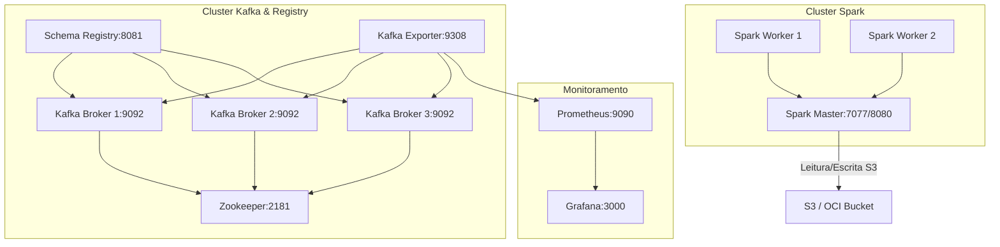

# Arquitetura de Infraestrutura DINAMO (Infrastructure.md)

Este documento descreve a infraestrutura baseada em Docker Containers projetada para orquestrar e monitorar a plataforma **DINAMO**. A análise baseia-se exclusivamente nas especificações contidas no [Discovery_Report.md](file:///${HOME}/dinamo_etl_project/Discovery_Report.md).

---

## 1. Visão Geral da Infraestrutura

O ambiente do DINAMO é executado de forma isolada em containers Docker, fornecendo processamento distribuído através de um cluster Apache Spark local e mensageria robusta por meio de um cluster Apache Kafka com monitoramento integrado via Prometheus/Grafana.

---

## 2. Diagrama de Rede e Serviços

Todos os serviços operam conectados à rede virtual do Docker denominada `dinamo-network`.

*Evidência de rastreabilidade: [Discovery_Report.md - Seção 4 (Arquitetura Kafka & Schema Registry)](file:///${HOME}/dinamo_etl_project/Discovery_Report.md#4-arquitetura-kafka--schema-registry).*

---

## 3. Detalhamento dos Componentes e Serviços

### A. Cluster de Mensageria (Kafka & Zookeeper)
* **Zookeeper:** Atua como coordenador de metadados do cluster Kafka (`container_name: dinamo-zookeeper`, porta `2181`).
* **Kafka Brokers (kafka-1, kafka-2, kafka-3):** Cluster com 3 brokers ativos. 
  * **Replicação:** Fator de replicação padrão de 3 (`KAFKA_DEFAULT_REPLICATION_FACTOR: 3`) e mínimo de ISR de 2 (`KAFKA_MIN_INSYNC_REPLICAS: 2`) para garantir tolerância a falhas e consistência transacional.
  * **Particionamento Padrão:** Definido com 12 partições (`KAFKA_NUM_PARTITIONS: 12`) para suportar alto throughput.
* **Schema Registry Confluent:** Centraliza o gerenciamento de esquemas Avro/JSON de tópicos do SPED. Configurado em modo de retrocompatibilidade (`SCHEMA_REGISTRY_AVRO_COMPATIBILITY_LEVEL: BACKWARD`).
* *Evidência de rastreabilidade: [Discovery_Report.md - Seção 4.A](file:///${HOME}/dinamo_etl_project/Discovery_Report.md#a-servios-da-stack-de-mensageria).*

### B. Cluster de Processamento (Apache Spark)
* **Spark Master:** Ponto de entrada para submissão dos jobs. Expõe a Web UI na porta `8080` e aceita conexões RPC na porta `7077`.
* **Spark Workers (worker-1, worker-2):** Executam o processamento distribuído. Ambos contêm variáveis de ambiente apontando para o cluster Kafka interno e credenciais de S3/OCI.
* *Evidência de rastreabilidade: [Discovery_Report.md - Seção 4.A (Spark Master/Workers)](file:///${HOME}/dinamo_etl_project/Discovery_Report.md#4-detalhes-de-arquitetura-apache-spark).*

### C. Stack de Observabilidade (Prometheus & Grafana)
* **Kafka Exporter:** Coleta métricas de consumo de tópicos fiscais casando com a regex `sped.*` e consumer groups `dinamo.*`. Expõe as métricas na porta `9308`.
* **Prometheus & Grafana:** Prometheus raspa as métricas dos exporters e do Spark, disponibilizando os dados em painéis visuais no Grafana (porta `3000`).
* *Evidência de rastreabilidade: [Discovery_Report.md - Seção 4.A (Monitoramento & Observabilidade)](file:///${HOME}/dinamo_etl_project/Discovery_Report.md#a-servios-da-stack-de-mensageria).*

---

## 4. Volumes e Armazenamento

Os seguintes volumes nomeados são mantidos pelo Docker Compose para garantir a persistência e compartilhamento de dados:
* `zookeeper-data` e `zookeeper-logs`: Estado e logs do Apache Zookeeper.
* `spark-checkpoints`: Armazenamento de checkpoints de processamento estruturado.
* `spark-data-lake`: Volume local simulando o Data Lake na máquina local.
* `../dinamo_web` montado em `/opt/spark/app`: Mapeamento do código python da aplicação nos workers para execução direta sem necessidade de rebuilding da imagem de Spark.
* *Evidência de rastreabilidade: [Discovery_Report.md - Seção 4.A (Spark Master/Workers) e docker-compose.yml](file:///${HOME}/dinamo_etl_project/infrastructure/docker-compose.yml#L346-L350).*
