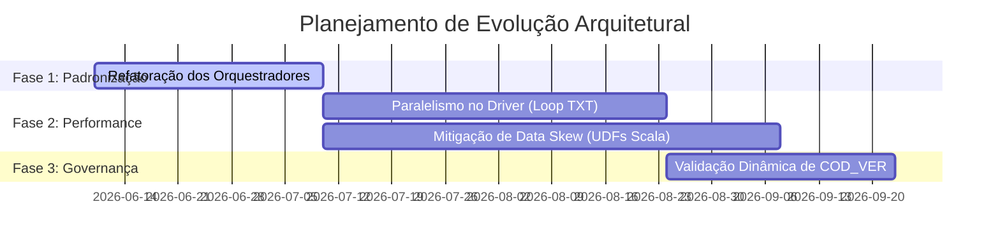

# Roteiro de Evolução da Arquitetura (RoadmapArchitecture.md)

Este documento descreve as possíveis evoluções arquiteturais para a plataforma **DINAMO**, estruturadas a partir das recomendações e débitos técnicos descritos em [TechnicalAssessment.md](file:///${HOME}/dinamo_etl_project/docs/TechnicalAssessment.md) e fundamentadas nas evidências do [Discovery_Report.md](file:///${HOME}/dinamo_etl_project/Discovery_Report.md).

---

## 1. Visão Geral do Roadmap

O roadmap está estruturado em três fases de maturidade de engenharia de dados, focando primeiro na facilidade de manutenção e, em seguida, em ganhos de escalabilidade horizontal e resiliência:

---

## 2. Fase 1: Padronização e Facilidade de Manutenção (Curto Prazo)

### Abstração da Classe Base de Pipelines
* **Objetivo:** Resolver a duplicação maciça de código identificada nos scripts de entrada `main_*_v2.py`.
* **Escopo:**
  * Criar uma classe abstrata `BaseSpedPipeline` contendo a lógica comum de inicialização de Spark Session, leitura de arquivos TXT, verificação e persistência de checkpoints, cacheamento e materialização Silver.
  * Herdando desta base, os scripts específicos de obrigações (ECD, ECF, Fiscal, Contribuições) passarão a conter apenas as regras de direcionamento de construtores de relatórios Gold, reduzindo o volume geral de código redundante.

---

## 3. Fase 2: Escalabilidade e Performance (Médio Prazo)

### Processamento Paralelo Multi-Thread de Lotes de Arquivos
* **Objetivo:** Eliminar o gargalo do laço de repetição serial `for` no processamento de arquivos.
* **Escopo:**
  * Implementar um pool de threads no nível de Driver (usando `ThreadPoolExecutor` nativo do Python) para enviar múltiplos arquivos em paralelo para processamento distribuído no cluster Spark, aumentando a utilização de CPU dos Spark Workers em picos de carga.

### Otimização da Máquina de Estados da Hierarquia SPED
* **Objetivo:** Reduzir a latência do resolvedor de parentesco e mitigar riscos de OOM em arquivos gigantes.
* **Escopo:**
  * Desenvolver a lógica da máquina de estados do `apply_parent_child_relationships` usando expressões estruturadas nativas do Spark SQL (ex: funções de janela de busca) ou empacotar a lógica em um User Defined Aggregate Function (UDAF) escrita em Scala/Java (nativa da JVM). Isto evitará a serialização Py4J/RDD lenta em Python.

---

## 4. Fase 3: Governança Semântica e Resiliência (Longo Prazo)

### Validação Dinâmica baseada na Versão do Layout (COD_VER)
* **Objetivo:** Impedir o deslocamento silencioso de índices de colunas devido a mudanças estruturais governamentais.
* **Escopo:**
  * Modificar o extrator para ler inicialmente apenas o registro raiz `0000`, extraindo a informação de `COD_VER` (versão do manual do SPED).
  * Carregar em tempo de execução o `FIELDS_MAP` posicional correspondente àquela versão exata mapeada em arquivos YAML versionados, garantindo isolamento semântico nas evoluções futuras da Receita Federal.
