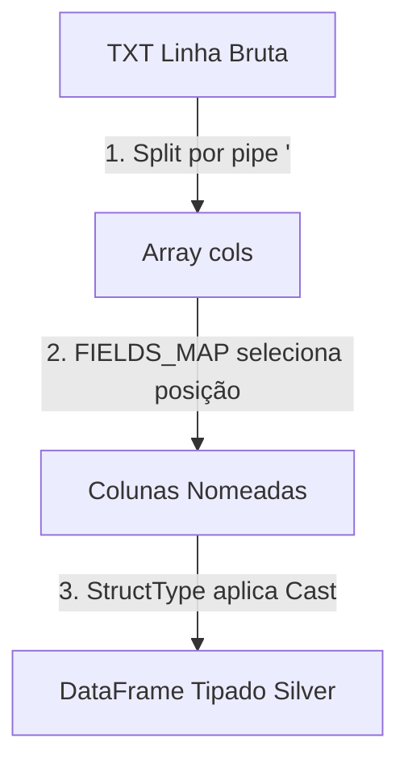
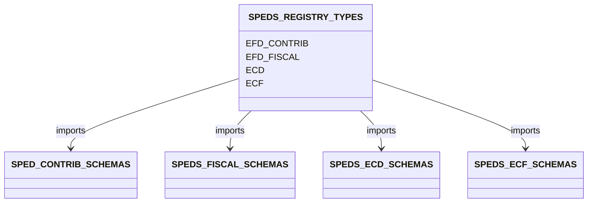
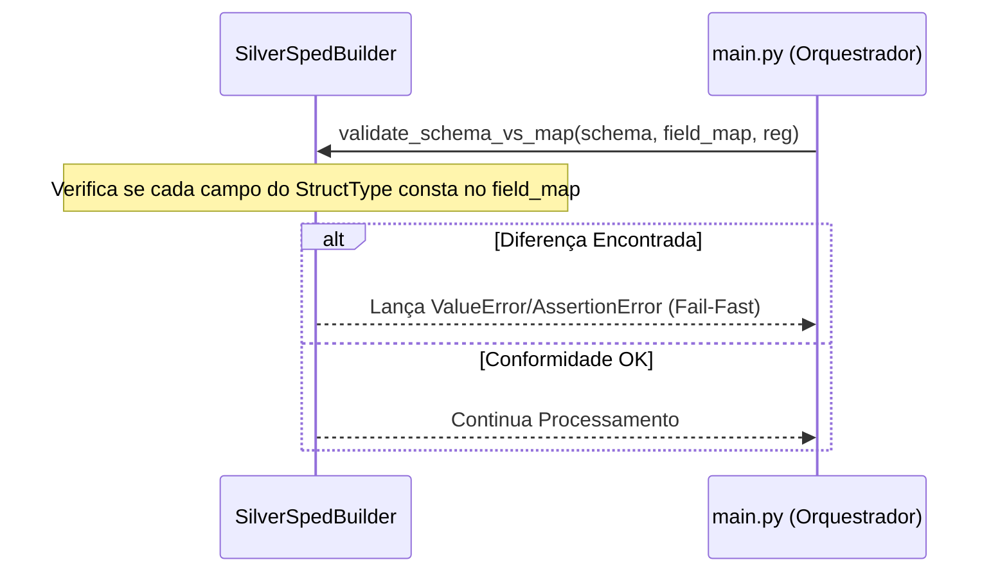

# Arquitetura de Schemas e Validação (SchemaArchitecture.md)

Este documento descreve a governança de schemas, regras posicionais de campos e a estratégia de validação da plataforma **DINAMO**. A análise baseia-se unicamente nas evidências documentadas no [Discovery_Report.md](file:///${HOME}/dinamo_etl_project/Discovery_Report.md).

---

## 1. Estratégia Geral de Schemas Fiscais

Devido ao SPED não possuir cabeçalhos em formato texto tradicional, o DINAMO implementa uma modelagem híbrida:
* **StructTypes (Tipagem Spark):** Define os tipos de dados reais (ex: `DecimalType`, `DateType`, `StringType`) usados pelo Spark.
* **FIELDS_MAP (Mapeamento Posicional):** Define os índices posicionais no vetor delimitado por pipes (`|`) para cada registro específico.

*Evidência de rastreabilidade: [Discovery_Report.md - Seção 2.A e 2.B](file:///${HOME}/dinamo_etl_project/Discovery_Report.md#2-arquitetura-dos-schemas-e-estratgia-de-validao).*

---

## 2. Estrutura dos Módulos SPED

O projeto suporta schemas estáticos e mapas posicionais para quatro obrigações através do registro global:
* **Classe de Registro:** `SPEDS_REGISTRY_TYPES` em [`dinamo_web/src/dinamo_web/schemas/register_type_sped.py`](file:///${HOME}/dinamo_etl_project/dinamo_web/src/dinamo_web/schemas/register_type_sped.py) (linhas 8 a 28).

1. **EFD Contribuições:** Definições mapeadas em `SPED_CONTRIB_SCHEMAS` e `SPED_CONTRIB_FIELDS_MAP` no arquivo [`contrib_schema.py`](file:///${HOME}/dinamo_etl_project/dinamo_web/src/dinamo_web/schemas/contrib_schema.py).
2. **EFD Fiscal:** Definições mapeadas em `SPEDS_FISCAL_SCHEMAS` e `SPEDS_FISCAL_FIELDS_MAP` em `fiscal_schema.py`.
3. **ECD:** Definições mapeadas em `SPEDS_ECD_SCHEMAS` e `SPEDS_ECD_FIELDS_MAP` em `ecd_schema.py`.
4. **ECF:** Definições mapeadas em `SPEDS_ECF_SCHEMAS` e `SPEDS_ECF_FIELDS_MAP` em `ecf_schema.py`.

*Evidência de rastreabilidade: [Discovery_Report.md - Seção 1 (Módulos Fiscais SPED Processados)](file:///${HOME}/dinamo_etl_project/Discovery_Report.md#1-mdulos-fiscais-sped-processados).*

---

## 3. Estratégias de Validação (Fail-Fast)

Para prevenir corrupção silenciosa de dados e erros de execução em runtime, a classe `SilverSpedBuilder` implementa validações rigorosas em tempo de carregamento:

* **Validação de Conformidade:** O método `validate_schema_vs_map` (linhas 104 a 140 de `silver_layer.py`) varre recursivamente os campos do Spark `StructType` de um registro contra as entradas declaradas no seu respectivo `FIELDS_MAP`. Caso falte algum mapeamento posicional para um campo tipado, o processamento do arquivo atual é imediatamente abortado, impedindo que campos fiquem vazios ou com deslocamento posicional de colunas.

*Evidência de rastreabilidade: [Discovery_Report.md - Seção 2.B](file:///${HOME}/dinamo_etl_project/Discovery_Report.md#2-arquitetura-dos-schemas-e-estratgia-de-validao).*

---

## 4. Canonical Schema (Superset Canônico) e Governança Semântica

Como o SPED é particionado por registros (`REG`) que possuem layouts inteiramente distintos, a consolidação na camada Silver exige uma estratégia de unificação semântica:
* **Estratégia de Schema Merge:** O DINAMO une os dataframes individuais de cada registro usando `reduce` e a expressão `unionByName(..., allowMissingColumns=True)`. O Spark gera um DataFrame canônico unificado (superset) que engloba a união de todas as colunas existentes no layout.
* **Preservação de Evolução do Layout:** Ao salvar em Delta Lake, o pipeline ativa explicitamente `.option("mergeSchema", "true")`. Isso permite que novos campos adicionados ao layout SPED pelo governo ao longo dos anos sejam adicionados automaticamente ao histórico Delta sem quebrar compatibilidade reversa das partições antigas.

*Evidência de rastreabilidade: [Discovery_Report.md - Seção 2.B e 5.B](file:///${HOME}/dinamo_etl_project/Discovery_Report.md#2-arquitetura-dos-schemas-e-estratgia-de-validao).*
